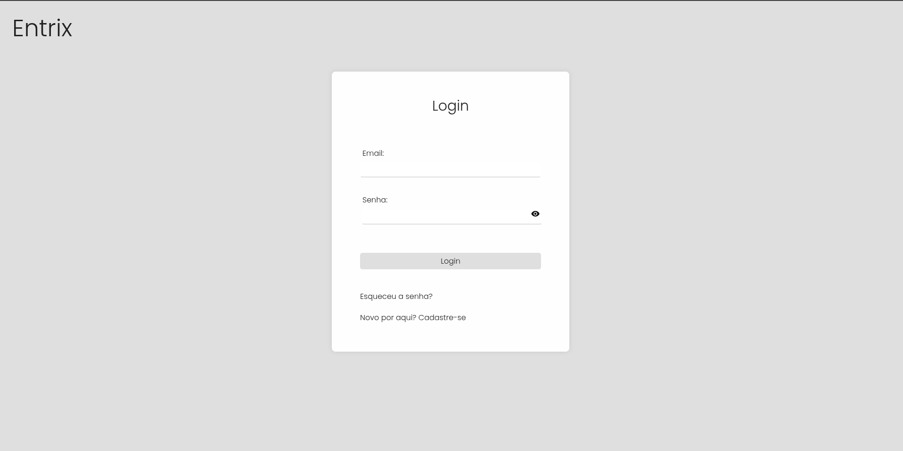
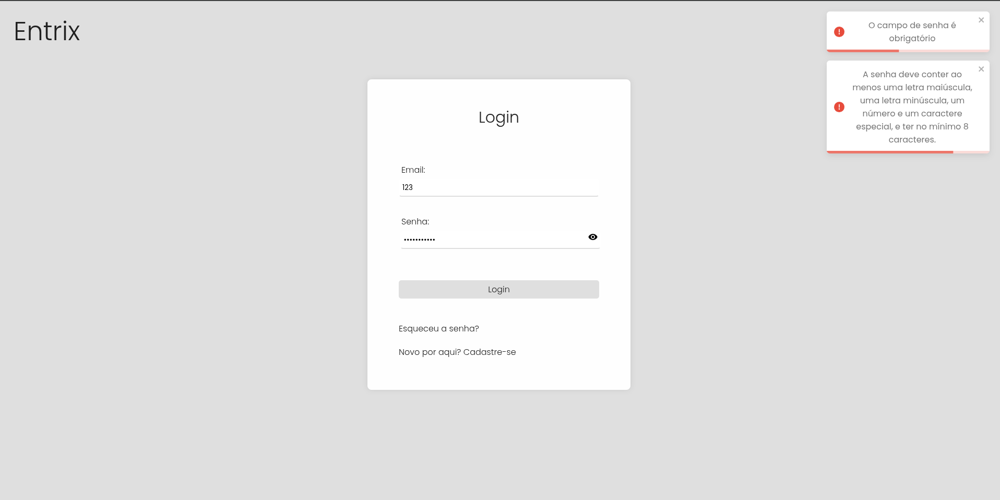
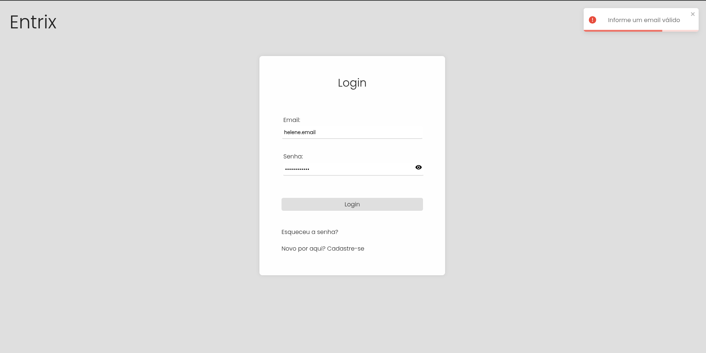
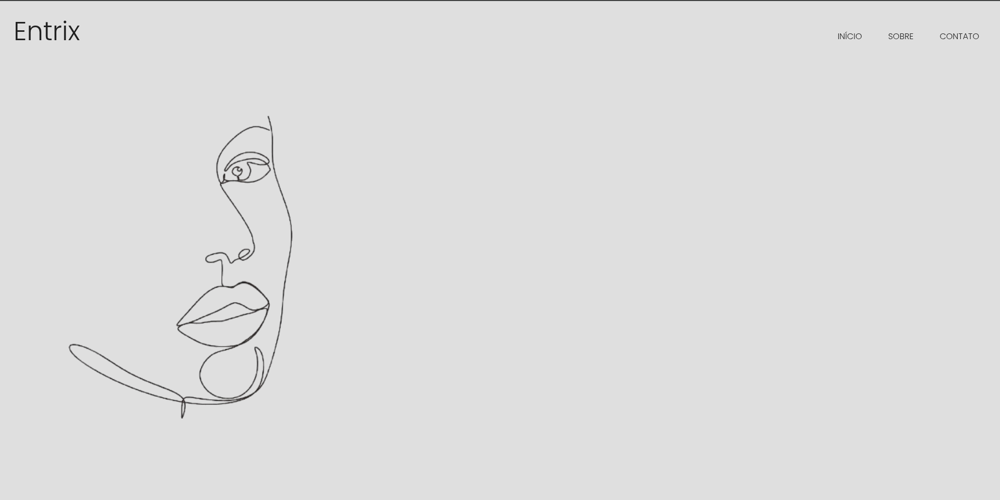
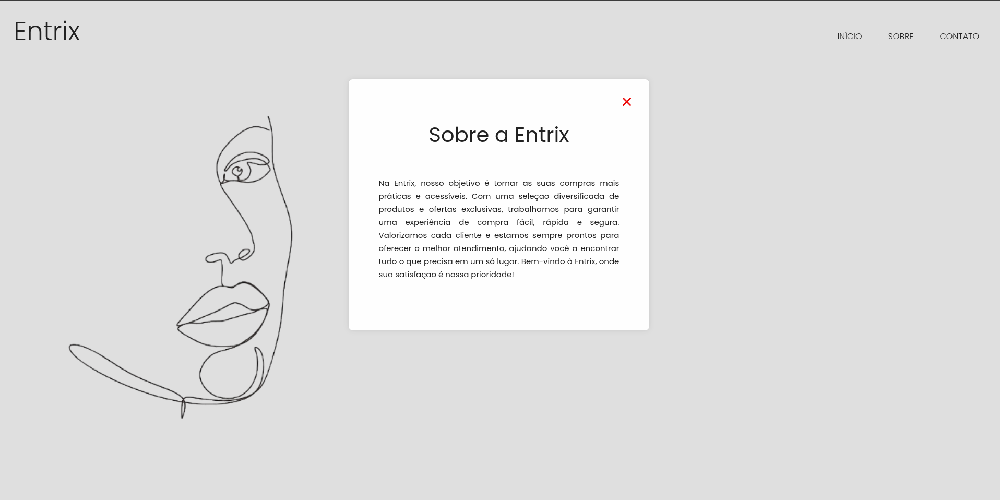
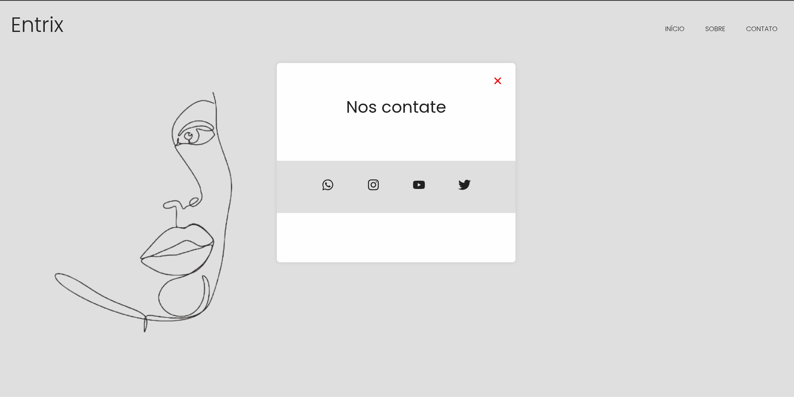
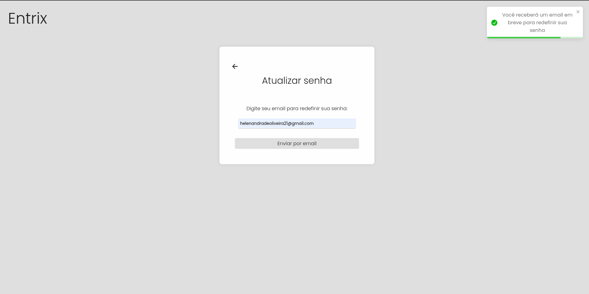
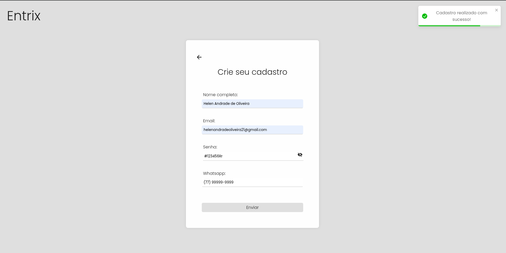

# Projeto criado utilizando ReactJs e Typescript 

## Neste projeto, é possível acessar a página principal utilizando e-mail e senha. O sistema realiza validações para todos os campos no formulário de criação de cadastro, bem como para o acesso com e-mail e senha já cadastrados. Também há uma página dedicado à redefinição de senha. Todos os botões possuem funcionalidades completas.

  
  
  
  
  
  
  
  

  Feito com ♡ por Helen Andrade

